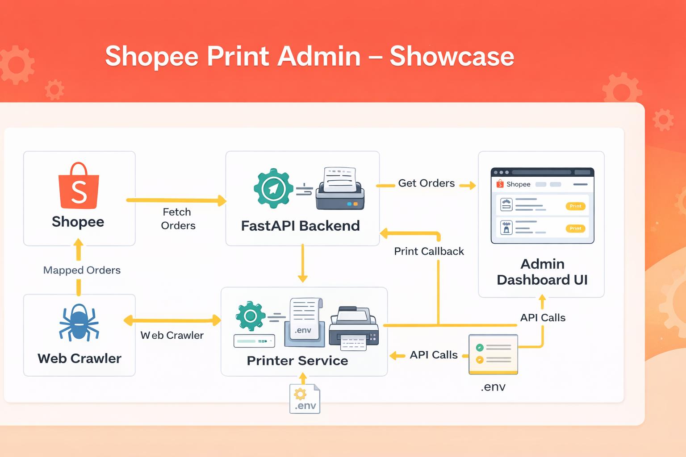

  

Shopee Print Admin（展示版）

本 Repository 為 展示用途（Showcase），提供前端 Admin UI 以及系統架構與介面整合說明，主要用於作品集展示與商務洽談評估。

不包含：爬蟲抓取機制、訂單判定與解析規則、列印模板／列印驅動、資料庫連線與實際後端實作等商業核心

不提供：任何 Cookie、Session、API Key、資料庫帳密或真實營運資料

系統架構

完整系統分層與模組互動關係請參考：
docs/architecture.md
（僅呈現架構與資料流概念，不揭露實作細節）

Demo（不需後端）

本展示版可於 無後端環境 下進行操作示範：

以瀏覽器直接開啟 admin.html

點選「Demo 假資料」即可瀏覽 UI 介面與操作流程

對接私有後端（選用）

若你另有自行開發或授權之 私有後端服務（不屬於本 Repository），可於頁面中填入：

API Base：http://YOUR_HOST:8000

API Key：你的 X-API-Key

並點選「刷新」以測試連線狀態。
（本 Repository 不包含任何後端實作或連線設定）

檔案結構

admin.html：展示版前端入口（純前端）

assets/admin.js：前端互動邏輯（已移除 .env／Cookie／Session 更新功能）

assets/admin.css：樣式定義

docs/architecture.md：系統架構圖（Mermaid）

安全與授權說明

本 Repository 僅供 展示、評估與討論用途，不構成任何形式之軟體授權或可直接商用之交付內容。
請勿於公開環境提交任何敏感資訊（包含 .env、Cookie、Session、帳密、真實訂單資料或日誌）。
