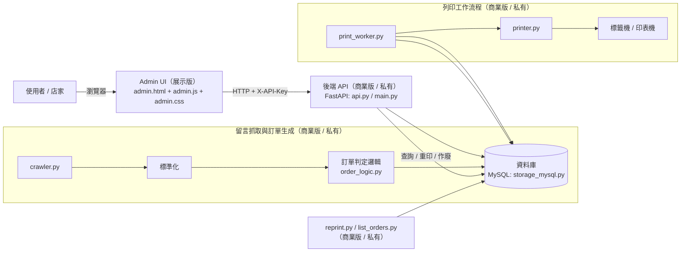

# 系統架構圖（展示版）

```mermaid
flowchart LR
  U[使用者 / 店家] -->|瀏覽器| UI[Admin UI（展示版）\nadmin.html + admin.js + admin.css]

  UI -->|HTTP + X-API-Key| API[後端 API（商業版 / 私有）\nFastAPI: api.py / main.py]
  API --> DB[(資料庫\nMySQL: storage_mysql.py)]

  subgraph Ingestion[留言抓取與訂單生成（商業版 / 私有）]
    C[crawler.py] --> N[標準化]
    N --> L[訂單判定邏輯\norder_logic.py]
    L --> DB
  end

  subgraph Printing[列印工作流程（商業版 / 私有）]
    W[print_worker.py] --> DB
    W --> P[printer.py]
    P --> PR[標籤機 / 印表機]
    W --> DB
  end

  API -->|查詢 / 重印 / 作廢| DB
  R[reprint.py / list_orders.py（商業版 / 私有）] --> DB
```
